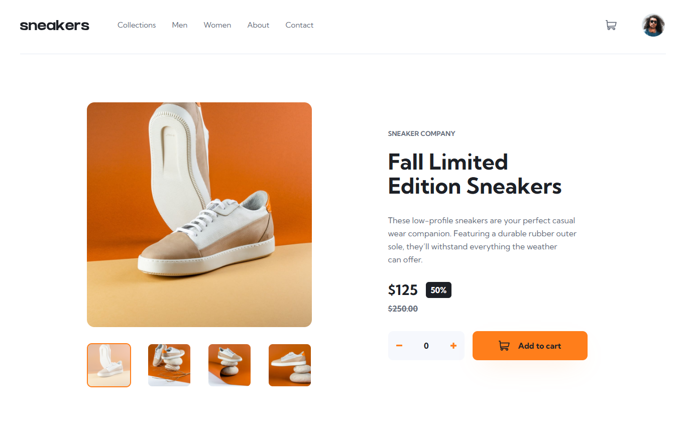

# Frontend Mentor - E-commerce product page solution

This is a solution to the [E-commerce product page challenge on Frontend Mentor](https://www.frontendmentor.io/challenges/ecommerce-product-page-UPsZ9MJp6). Frontend Mentor challenges help you improve your coding skills by building realistic projects.

## Table of contents

- [Overview](#overview)
  - [The challenge](#the-challenge)
  - [Screenshot](#screenshot)
  - [Links](#links)
- [My process](#my-process)
  - [Built with](#built-with)
  - [What I learned](#what-i-learned)
- [Author](#author)

## Overview

### The challenge

Users should be able to:

- View the optimal layout for the site depending on their device's screen size
- See hover states for all interactive elements on the page
- Open a lightbox gallery by clicking on the large product image
- Switch the large product image by clicking on the small thumbnail images
- Add items to the cart
- View the cart and remove items from it

### Screenshot

### Links

- Solution URL: [Challenge Solution](https://www.frontendmentor.io/solutions/e-commerce-product-page-e3KFJYyXwF)
- Live Site URL: [E-commerce Product page](https://gustavo2023.github.io/ecommerce-product-page/)

## My process

### Built with

- Semantic HTML5 markup
- CSS custom properties
- Flexbox
- JavaScript

### What I learned

1. Implementing a Responsive Lightbox Gallery:

   - **Conditional Rendering for Desktop vs. Mobile:**

     - Practice to conditionally enable the lightbox feature only for desktop screen sizes (`window.innerWidth > 768`) in JavaScript. This involved checking the screen width before allowing the lightbox to open.
     - For mobile, a simpler image slider was implemented using previous/next buttons directly manipulating the main product image, providing a better user experience on smaller screens. The `updateViewBasedOnScreenSize` function was crucial for toggling the visibility of mobile navigation buttons and disabling lightbox functionality.

   - **Dynamic Image Updates and Thumbnail Synchronization:**

     - Mastered updating the `src` and `alt` attributes of both the main product image and the lightbox image dynamically using JavaScript (`updateMainProductImage`, `updateLightboxImage`).
     - Implemented logic to synchronize the active state of thumbnails (both in the main gallery and within the lightbox) with the currently displayed large image (`setActiveThumbnail`). This involved iterating through thumbnail collections and toggling an "active" class and ARIA attributes.

   - **Accessibility (ARIA) and User Experience for Lightbox:**

     - Gained experience in making the lightbox accessible by managing `aria-hidden`, `aria-selected`, and `tabindex` attributes. For instance, setting `aria-hidden="true"` when the lightbox is closed and `aria-hidden="false"` when open.
     - Ensured intuitive lightbox navigation through previous/next buttons and thumbnail clicks. Closing the lightbox via a dedicated button, clicking the overlay, or pressing the "Escape" key (`handleEscapeKeyForLightbox`, `handleLightboxOverlayClick`) were important UX considerations.
     - Managing body scroll (`document.body.style.overflow = "hidden";`) when the lightbox is open to prevent background scrolling.

   - **CSS for Lightbox Presentation:**

     - Utilized CSS for the visual appearance of the lightbox, including fixed positioning, an overlay, and styling for the content, navigation buttons, and thumbnails. The `.lightbox.open` class was key to controlling visibility and transitions.

2. Developing Shopping Cart Logic:

   - **Client-Side State Management for Cart:**
     - Learned to manage the shopping cart's state using a simple JavaScript object (`cart = {}`), where product IDs are keys and quantities are values. This allowed for easy addition, modification (incrementing quantity), and deletion of items.
   - **Dynamic DOM Manipulation for Cart Display:**
     - Gained proficiency in dynamically creating and removing HTML elements to represent cart items (`createCartItemDOM`, `clearCartDOMItems`). This involved using `document.createElement`, setting `innerHTML`, and appending/removing child elements from the cart container.
     - The `renderCartItemsDOM` function was central to iterating over the `cart` object and displaying each item.
   - **Synchronizing UI with Cart State:**
     - Understood the importance of a central function (`updateCartDisplay`) to orchestrate all UI updates related to the cart. This function ensured that clearing old items, rendering new ones, updating the empty cart message/checkout button visibility (`updateCartVisibility`), and refreshing the cart icon badge (`updateCartIconBadge`) happened consistently after any cart modification.
   - **Handling Item Quantities:**
     - Implemented logic for users to select item quantities (`selectedQuantity`) using "+" and "-" buttons (`increaseSelectedQuantity`, `decreaseSelectedQuantity`).
     - Ensured that items are only added to the cart if a quantity greater than zero is selected (`handleAddToCart`). After adding to the cart, the `selectedQuantity` was reset.
   - **User Feedback and Interaction:**
     - Provided immediate visual feedback by updating the cart icon badge with the total number of items.
     - Handled the display of an "empty cart" message when no items are present and a "checkout" button when there are items.

## Author

- Frontend Mentor - [@gustavo2023](https://www.frontendmentor.io/profile/gustavo2023)
